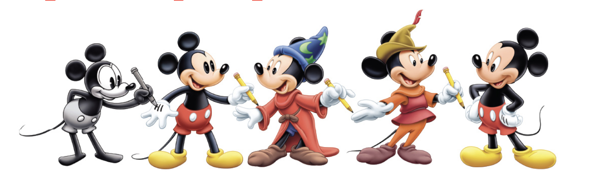

## Project Title
Disney's Next Blockbuster Movie

## Team Members
Matt Weiper   
Hema Vyas

## Project Description/Outline

The Magnificent Mouse!  The Grand Empire that is Disney has produced hundreds of movies.  Our goal is to find out if we can predict what type of movie could be the next big movie blockbuster for Disney.  

What factors affect high-grossing Disney movies.  
Our goal is to find out what the common theme is between the high-grossing movies.

## Research Questions to Answer
Is genre a factor into low vs. high?   
Is rating a factor into low vs. high?      
Is release date a factor into low vs. high?

These are determinants we want to dive into and see if there is any common trend amongst the highest grossing Disney movies
## Datasets to Be Used

https://www.kaggle.com/rashikrahmanpritom/disney-movies-19372016-total-gross    

## Rough Breakdown of Tasks
First, we will need to collect the datasets needed to answer above questions.   
Then we will interpret and clean data, leaving only information we are needing for study.   
Next, we will create plots to show specific answers to questions (e.g. top movies genres, rating, year, etc.).   
Lastly, we will write a summary with our findings. 

Site referenced for image
https://d23.com/walt-disney-archives/
